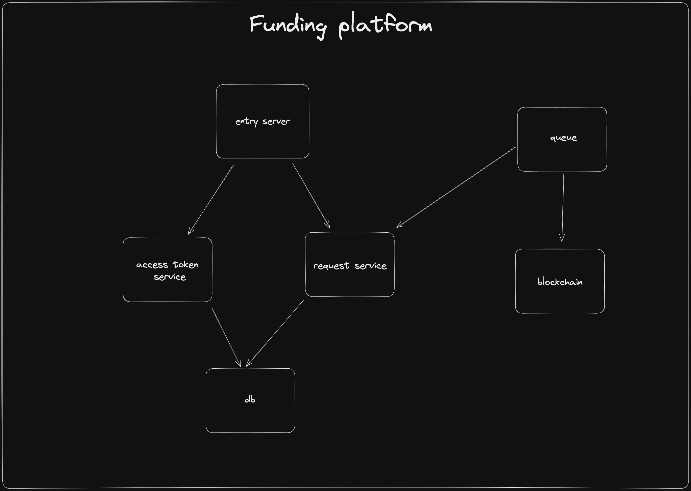

# Funding service

## Description

In the RPCh ecosystem, we would like to incentivize node participation. While the discovery platform handles who is being rewarded with funds, we need to have a way for them to be sent to the nodes.
The funding service acts as a standalone service which it’s purpose is to solely send funds to nodes, it is only accessible via our VPC and it’s not exposed publicly.

